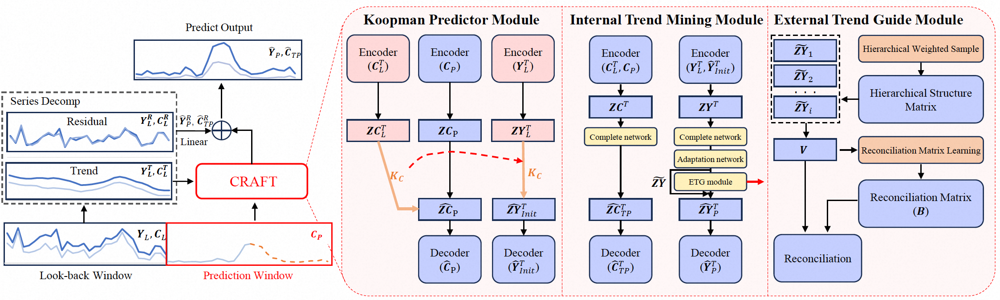

# CRAFT

Code and dataset for the [paper](https://arxiv.org/abs/2505.13896) "CRAFT: Time Series Forecasting with Cross-Future Behavior Awareness"

# Overwrite

Time series forecasting(TSF) is usually constrained by the uncertainty dilemma of
predicting future data with limited past observations. To settle this question, 
we explore the use of Cross-Future Behavior (CFB) in TSF, which occurs before the 
current time but takes effect in the future. We leverage CFB features and propose
the CRoss-Future Behavior Awareness based Time Series Forecasting method (CRAFT). 
The core idea of CRAFT is to utilize the trend of cross-future behavior to mine 
the trend of time series data to be predicted.




# Environment Settings

Install the Python dependencies:
 
 ```pip install -r requirements.txt```


# Codes & Datasets

To main module of CRAFT:

 ```craft.py```

